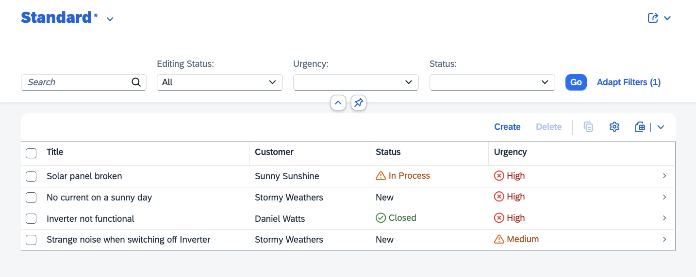

# Update Incidents app

Let's extend the incidents app with necessary configurations and annotations that our plugin will define.

## Wire the plugin to the base app

In the _package.json_ of the incidents application (not the plugin!) we add a dependency to our criticality plugin and we also define criticality as an [npm workspace](https://docs.npmjs.com/cli/v7/using-npm/workspaces)

```js
{
  ...,
  "workspaces": [
    "criticality"
  ],
  "dependencies": {
    ...
    "criticality": "*"
  },
  ...
}
```

Now you can install the dependencies and run the cds server locally:

```sh
npm i && cds w 
```

You should see something like this in the console:

```sh
...
my critical plugin
[cds] - loaded model from 5 file(s):
...
```

To see the output from the plugins in the logs, raise the log level on the plugin component with

```sh
DEBUG=plugins cds w
```

### Add annotations in the data model

Before we add the annotations, check that criticality information is unavailable in the urgency data. You can run the application with `cds watch` and check the endpoints for [status](http://localhost:4004/odata/v4/processor/Status) (criticality is null) and [urgency](http://localhost:4004/odata/v4/processor/Urgency).

To extend the CDS models with criticality annotations, create the file `db/criticality.cds` and add the annotations as follows:

```js
using { sap.capire.incidents as my } from './schema';

annotate my.Status with {
  code @criticality {
    new @criticality.Neutral;
    assigned @criticality.Critical;
    in_process @criticality.Critical;
    on_hold @criticality.Negative;
    resolved @criticality.Positive;
    closed  @criticality.Positive;
  };
};

extend my.Urgency {
  criticality: Integer;
};

annotate my.Urgency with {
  code @criticality {
    high @criticality.Negative;
    medium @criticality.Critical;
  };
};
```

### Run the incidents app and view the results

You can run `cds watch` and visit [incidents app UI](http://localhost:4004/incidents/webapp/index.html) to check that the `status` and `urgency` columns now have the criticality indications.


### Overwrite plugin configurations in the incidents app

Incidents app uses SAP Fiori and by default the UI annotations are added! You can overwrite this configuration by setting the flag to `false` in the `package.json` of the base app (not in the plugin) and run the incidents app to view the changes!
This might particularly make sense, if you are using non SAP Fiori UIs. Then you can still fetch the criticality data but turn off SAP Fiori annotations.

```json
"cds": {
    "requires": {
      "criticality": {
        "fioriAnnotations": false
      }
    }
  }
```

